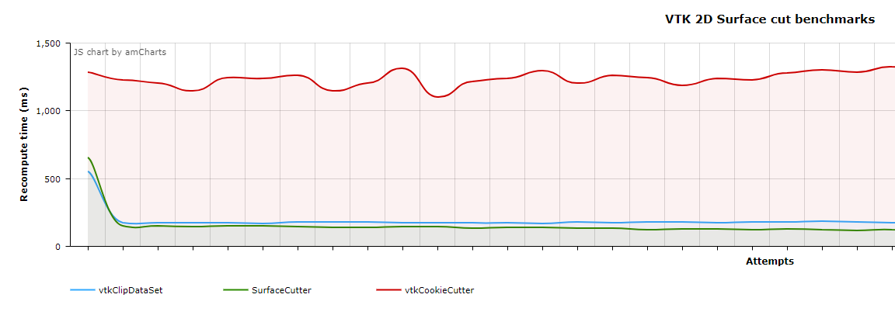

# SurfaceCutter
Cut portions of a triangulated surface with 2D polygons. Offers control over what portion is to be retained (Inside/Outside).
It was developed to be as fast as possible and retain arithmetic precision in case of mixed precision datasets.

This could serve as an efficient, almost always precise alternative to VTK's clipping filters in 2D.
The implementation **does not** support cutting volumes. For reference, take a look at the benchmarks and results..

The loop polygons are assumed to lie in x-y plane.

### Usage
```c++
#include <SurfaceCutter.h>

auto cutter = vtkSmartPointer<SurfaceCutter>::New();

// xxx: filter that outputs a vtkPolyData/vtkUnstrucutredGrid
cutter->SetInputConnection(0, xxx->GetOutputPort());

// yyy: filter that outputs a vtkPolyData
cutter->SetInputConnection(1, yyy->GetOutputPort());

// InsideOutOn: retain surface inside loops. InsideOutOff: retain surface outside loops.
cutter->InsideOutOn(); // (or) cutter->InsideOutOff(); default is on.

// TagAcquiredPointsOn: Loops points will be tagged with 1. Remaining points will be tagged 0.
cutter->TagAcquiredPointsOn(); // (or) cutter->TagAcquiredPointsOff(); default is on.

// ComputeBoolean2DOn: Remove triangles from surface when necessary (inside/outside a loop)
cutter->ComputeBoolean2DOn(); // (or) cutter->ComputeBoolean2DOff(); default is on.

cutter->Update();

```

## InsideOut = true


## InsideOut = false


## Translation/Rotation
With [SurfaceCutter](https://github.com/jaswantp/SurfaceCutter), it should be possible to
compute the cut mesh in realtime. Below are simple cases.


## SurfaceCutter
```
$ benchmark -m data/Surface.vtu -l data/TestPolys2.vtp
```

**closer...** *noice*

**even closer...** *goood*


## vtkClipDataSet
[vtkClipDataSet](https://vtk.org/doc/nightly/html/classvtkClipDataSet.html)
paired with 
[vtkImplicitSelectionLoop](https://vtk.org/doc/nightly/html/classvtkImplicitSelectionLoop.html)
and InsideOutOn.
```
$ benchmark -m data/Surface.vtu -l data/TestPolys2.vtp --vtkclipdataset
```
*janky around corners* *not goood*


## vtkCookieCutter
[vtkCookieCutter](https://vtk.org/doc/nightly/html/classvtkCookieCutter.html)
This filter doesn't yet support insideOut functionality. Check out [this MR](https://gitlab.kitware.com/vtk/vtk/-/merge_requests/5731)
```
$ benchmark -m data/Surface.vtu -l data/TestPolys2.vtp --vtkcookiecutter
```
*hmmm... oh no*


Now, about efficiency, 

# Test system and environment.
Compiler MSVC 19.27.29110
Release build VTK 9.0.1 with USE_64_BIT_IDS = true
CPU: Intel i7-8750H
Mem: 8G DDR4

The benchmark itself is a simple C++ program written using VTK library.
```
./benchmark.exe <option(s)>Options:
        -h,--help       Show this help message
        -m,--mesh       Specify mesh file (*.vtp, *.vtu)
        -l,--loops      Specify loops file (*.vtp)
        -i,--invert     Invert 2d boolean. Portions inside loops will be removed.
        -t,--translationspeed   Speed multiplier for mesh translations along x, y, z
        -r,--rotationspeed      Speed multiplier for mesh rotation along z
           --movable    Make the mesh movable.
           --vtkcookiecutter    Use vtkCookieCutter instead
           --vtkclipdataset     Use vtkClipDataset with vtkImplicitSelectionLoop instead


Controls:
W:    Z+ | S:     Z-
Up:   Y+ | Down:  Y-
Left: X+ | Right: X-
Z:   CCW | C:     CW (Looking down Z-)
```

The *benchmark* offers controls to *translate*/*rotate* the mesh. 
Such transformation recomputes the output of the surface cutters every frame.
An average over a couple 100 frames should tell who's better.
So, rotate the mesh with 'Z'/'C' and you should be able to reproduce the below results.

# Benchmarks


[benchmark.html](illustrations/benchmarks.html)

[SurfaceCutter](https://github.com/jaswantp/SurfaceCutter) is slightly faster than
[vtkClipDataSet](https://vtk.org/doc/nightly/html/classvtkClipDataSet.html). 
The drop at the end begins when none of the *mesh's* triangles intersect with the *loops* edges.
Perhaps [SurfaceCutter](https://github.com/jaswantp/SurfaceCutter) is faster now because 
it does bounding box tests and returns immediately. Otherwise, there is no considerable lag during interaction.
*But*, SurfaceCutter gives precise results in the 2D plane.

Realtime computations can be thrown out the window with [vtkCookieCutter](https://vtk.org/doc/nightly/html/classvtkCookieCutter.html). (Consistently > 1*s*)

## Algorithm deets:

Within the algorithm there are two entities, the *surface* that is to be cut and the *polygons* that cut the surface.
They are conveniently called *mesh* and *loops* throughout the implementation.

The algorithm is inherently limited to *loops* in the 2D plane (i.e, with normal along *+/-Z*).

* Work with a container of *TriMeta* for performance reasons. (Better than jumping across Points/Scalars array).
```
TriMeta
{
  bbox;
  coord {{x0, y0, z0}, {...}, {...}};
  discard;
  scalar;
  verts {v1, v2, v3};
}
```
* Use a container of *TriMeta* as cache and an active workspace for existing and new triangles.

* The *loop's* points are projected into a triangle from the surface.
(*triangle that contains the point in 2D*). 

* Construct a *subMesh* with the projected point and the triangle which we projected into. This triangle is replaced with the *subMesh* inplace.

* Throw the *edges* of the *loops* onto triangles. Here,
care is taken to handle precision loss when intersecting edges. Also, the *loop*'s *constraints* are identified in this step.
I could've used VTK's intersect routines, but they're not robust (work only with double precision), debugging it was a bit troublesome.

* Now, the intersection points are sorted ccw around the centroid and triangulated with an ear-cut method.
Following that, Flip triangulation's edges to ensure the *loop's* constraints make it to the final result. 
Here I could've used [vtkDelaunay2D](https://vtk.org/doc/nightly/html/classvtkDelaunay2D.html), but it sometimes got stuck forever in recursive 'CheckEdge'.

* If a triangle lies inside or outside a polygon (depends on the option), set `discard=true`

* At the end, the algorithm collects all triangles that were not *discard* and creates a new mesh.
