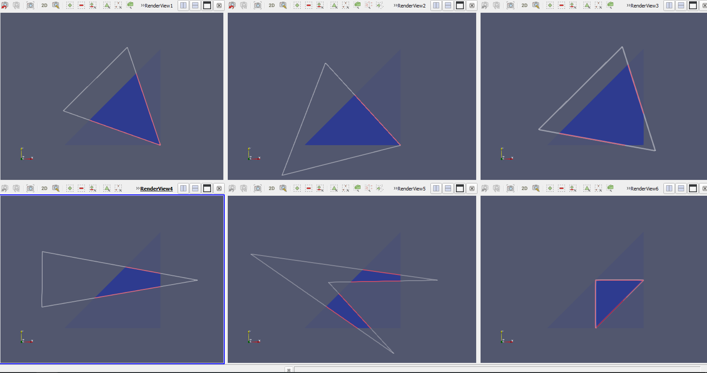
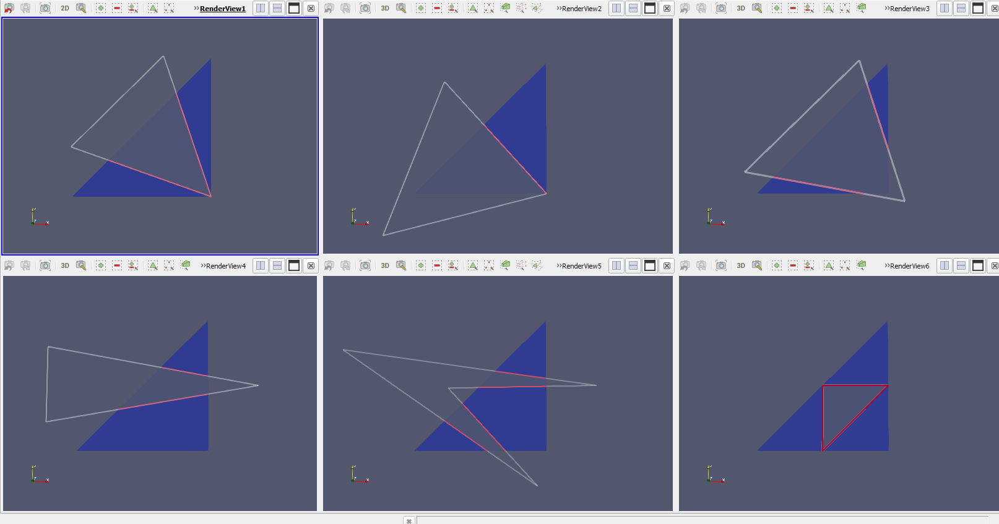

# SurfaceCutter
Cut triangulated surfaces with 2D loop polygons.

### Usage
```c++
#include <SurfaceCutter.h>

vtkNew<SurfaceCutter> cutter;

// xxx: filter that outputs a vtkPolyData
cutter->SetInputConnection(0, xxx->GetOutputPort());
// yyy: filter that outputs a vtkPolyData
cutter->SetInputConnection(1, yyy->GetOutputPort());
// remove stuff outside loops.
cutter->InsideOutOn();
// Loop points will be tagged '1'. 
cutter->ColorAcquiredPtsOn();
// Loop edges projected upon surface will be tagged '1'.
cutter->ColorLoopEdgesOn();

cutter->Update();
cutMesh = cutter->GetOutput(0); 

```

## InsideOut = true


## InsideOut = false


## Translation/Rotation
With [SurfaceCutter](https://github.com/jaswantp/SurfaceCutter), it should be possible to
compute the cut mesh in realtime. Below are simple cases.


## SurfaceCutter
```
$ benchmark -m data/Surface.vtu -l data/TestPolys2.vtp
```

**closer...** *noice*

**even closer...** *goood*


## vtkClipDataSet
[vtkClipDataSet](https://vtk.org/doc/nightly/html/classvtkClipDataSet.html)
paired with 
[vtkImplicitSelectionLoop](https://vtk.org/doc/nightly/html/classvtkImplicitSelectionLoop.html)
and InsideOutOn.
```
$ benchmark -m data/Surface.vtu -l data/TestPolys2.vtp --vtkclipdataset
```
*janky around corners* *not goood*


## vtkCookieCutter
[vtkCookieCutter](https://vtk.org/doc/nightly/html/classvtkCookieCutter.html)
This filter doesn't yet support insideOut functionality. Check out [this MR](https://gitlab.kitware.com/vtk/vtk/-/merge_requests/5731)
```
$ benchmark -m data/Surface.vtu -l data/TestPolys2.vtp --vtkcookiecutter
```
*hmmm... oh no*


Now, about efficiency, 

# Test system and environment.
Compiler MSVC 19.27.29110
Release build VTK 9.0.1 with USE_64_BIT_IDS = true
CPU: Intel i7-8750H
Mem: 8G DDR4

The benchmark itself is a simple C++ program written using VTK library.
```
./benchmark.exe <option(s)>Options:
        -h,--help       Show this help message
        -m,--mesh       Specify mesh file (*.vtp, *.vtu)
        -l,--loops      Specify loops file (*.vtp)
        -i,--invert     Invert 2d boolean. Portions inside loops will be removed.
        -t,--translationspeed   Speed multiplier for mesh translations along x, y, z
        -r,--rotationspeed      Speed multiplier for mesh rotation along z
           --movable    Make the mesh movable.
           --vtkcookiecutter    Use vtkCookieCutter instead
           --vtkclipdataset     Use vtkClipDataset with vtkImplicitSelectionLoop instead


Controls:
W:    Z+ | S:     Z-
Up:   Y+ | Down:  Y-
Left: X+ | Right: X-
Z:   CCW | C:     CW (Looking down Z-)
```
